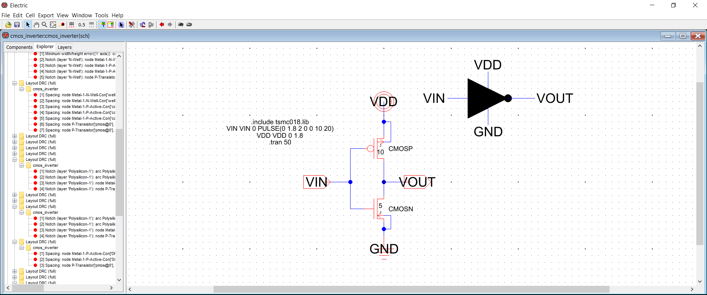
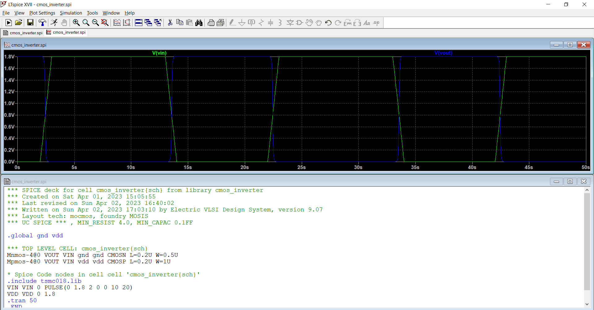
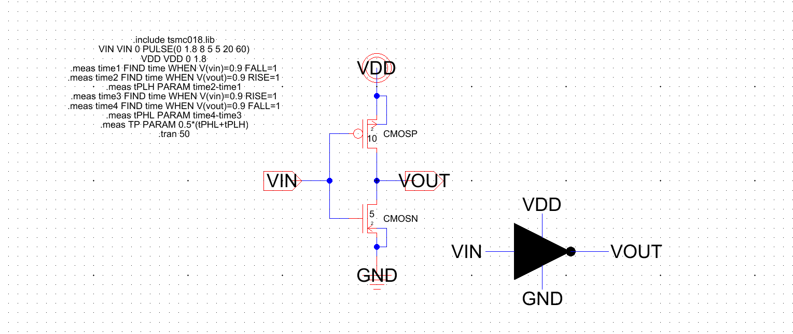

# CMOS-Inverter-3
### Inverter Layout
Whooo !! The last part of the project. This the last repository on the inverter where in I've designed the layout of the inverter. For this I've used the Electric VLSI tool and also integrated both LT spice and Electric for Simulation purpose.This part of the project deals in two phases Pre-Layout Simulation and Post Layout Simulation and also ill inculde what happens to the propagation dealy after layout.

***
### Contents

- [ 1. Inverter Pre-Layout](#1-Inverter-Pre-Layout)
- [ 2. Inverter Post-Layout](#2-Inverter-Post-Layout)

***

## 1.Inverter Pre-Layout

This part deals with the simulation of inverter in pre-layout part. This is the same simulation that ive dicussed earlier just that it is executed in Electric.
Here is the schematic of the inverter.I've also created the inverter icon/symbol to use the same inverter for other projects. Notice ive changed the width of the inverter. 
 
**Schematic**
 
 
 
**Output**
 
 
Lets look into the propagation delay,notice ive not connected any load accross the output terminals of the inverter. 
 
**Schematic**
 
 
 
**Output**
 
 
